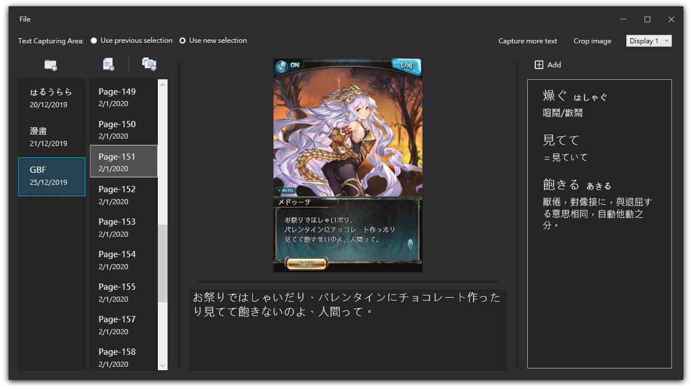

# Screen Capture Note App

## Introduction
This application is written for people who want to learn a language through watching video or playing game by screen capturing. Namely, user can record his/her screen, look back and study every word of interest, record the dictionary/internet result inside the application.
They can directly extract texts from image inside the application.

## How to use it
To enable google vision API, one needs to create his/her own google credential. For people interested in that they can visit <a href="https://cloud.google.com/vision/docs/quickstart">here</a>, enable the API, and download the credential as a json file.

After downloading the source code you can already download all missing packages, run it and get an exe file inside /debug/bin, the vision API will be enabled when the credential json file is placed at the same directory with the exe file (/debug/bin).
